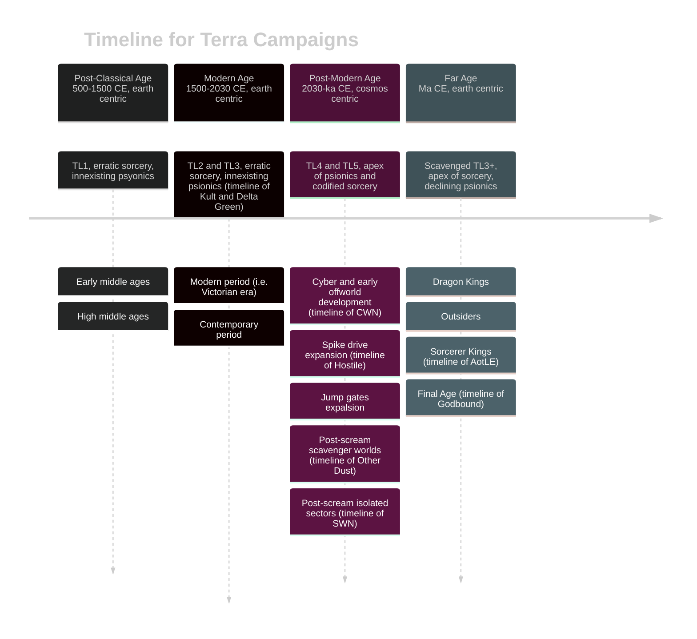
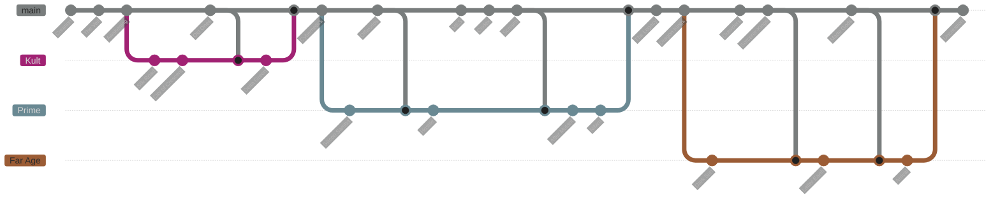

# Terra Campaigns

## Cosmology of Terra Campaigns

***Creation, and the Veil - before post classical age***

- The **Truth** exists, where the **Godbound** abode. The **Truth** is the unobserved, where everything is possible. Quantum mechanics, dreams, parallel realities are all facets of the **Truth**. **Humanity** was once **Godbound**.
- A **Godbound** known as the **Demiurge** ordered the creation of the **Veil**. The **Veil** blinded us, **Humanity**, from the **Truth** (kdl 189).
- **Malkuth** broke from the **Demiurge**'s plan, and weakened the **Veil.** Our Awakening started through technology development and erratic sorcery. 

***Post classical and modern ages campaigns***

- **Humanity**'s MES (Meta-dimensional Extroversion Syndrome) drove unprecedented technological capabilities, including the codification of psionic and sorcery.
- The Mandate AI found a breach in the **Veil**, and prepared the **Highshrine** to protect Humanity.
- The **Scream** in the **Veil** Nebula isolated the many worlds.

- On the ancient structures of the **Veil** and the remnants of the **Highshrine**, **Humanity** built the Legacy - a tapestry of laws that solidified **Humanity**'s control on our abode.
- In **Humanity**'s thirst for power, Sorcerer-Kings invaded the **Truth**, splintered and stole Celestial Engines to power their Made Gods.
- Without the Celestial Engines, the **Veil** faltered and the decadent **Legacy** deteriorated further. **Uncreation** started.

## Current Campaigns

### Hostile
> **Post-Modern Age | Spike Drive Expansion (2225 CE) | Near Earth Zone**  
> **Style**: Blue collar, gritty sci fi horror  
> **Sources**: SWN, Hostile, Hard Light  
> Played in 2023  

Valuable alien RNA is found in a debris field in the Perdurabo system. Tharsis Mining hires a crew to prospect the icy rocks and evaluate the commerciality of exploiting the RNA resource.

### BenooedeNova
> **Post-Modern Age | Post Scream Isolated Sectors (3234 CE) | Near Earth Zone**  
> **Style**: Space Opera  
> **Sources**: SWN, Hard Light  
> Played in 2023  

Alien tombs are found in the Hard Light system.

### Arrival
> **Far Age | Early Final Age | Latter Earth (Maqqatba)**  
> **Style**: Decadent high-fantasy, cosmic horror  
> **Sources**: 5e Ravenloft, Atlas of the Later Earth, Godbound, Silent Legions  
> Played in 2023  

The Angels have started to arrive in the Latter Earth. They come to revenge the destruction laid out in Heaven by the Sorcerer-Kings and their Made-Gods, at the end of the previous age. In the cold lands of Maqqatba, the celestial beings will face the Sorcerer-King of Turnskull in the south, while the outsider god Ethux'zhur attempts to gain dominion in Earth again.

## Future Campaigns

### Empires of the Silk Road
> **Post-Classical Age | 13th Century | Earth (Silk Road)**  
> **Style:** Gritty historical low fantasy  
> **Sources**: WWN (Drylands rules), Wolves of God, Nightmares Underneath, Historica Arcanum  

### The City of Crescent
> **Modern Age | 19th Century | Earth (Istanbul)**  
> **Style**: Gothic horror  
> **Sources**: Godbound (Bloodhound rules), Historica Arcanum, Kult  

In the heart of the 19th-century Ottoman Empire lies the enigmatic Istanbul. A thriving hub of culture and commerce, this city now harbors a dark and hidden truth, a sinister awakening known as "Blood in the Veil". Chosen individuals, once human, are now cursed and blessed with supernatural powers and a ravenous hunger for blood, while they are exposed to the a dark truth about mankind.

### Delta Green
> **Modern Age | 1990 CE | Earth (USA)**  
> **Style**: Cosmic horror, conspiracy  
> **Sources**: SWN, Delta Green, Silent Legions  

### Silicon Samba
> **Post-Modern Age | 2105 CE | Earth (Rio de Janeiro)**  
> **Style**: Latin cyberpunk  
> **Sources**: SWN, CWN  
> Prepared in 2023, halted game  

### After, Mutant
> **Post-Modern Age | 28th Century | Earth**  
> **Style**: Post apocalyptic, scavenger world  
> **Sources**: CWN, Other Dust, Fallout, Mutant Year Zero  

### Nibiru
> **Post-Modern Age | Post Scream Isolated Sectors | Formahault**  
> **Style**: Techno Fantasy  
> **Sources**: SWN, Codex, Nibiru  

### Dark Sun
> **Far Age | Era of Dragon Kings | Earth**  
> **Style**: Post apocalyptic fantasy  
> **Sources**: Shadowdark, AD&D Dark Sun  

# Tech Level (TL) Reference
***SWN & [Cepheus](https://www.orffenspace.com/cepheus-srd/equipment.html)***

| TL Description | SWN TL | Cepheus TL | Civilization 6 Eras         |
| -------------- | ------ | ---------- | --------------------------- |
| Primitive      | 0      | 0          | Ancient, Classical          |
| Medieval       | 1      | 1          | Medieval                    |
| Industrial     | 2      | 2-4        | Renaissance, Industrial     |
| Modern         | 3      | 5-7        | Modern, Atomic, Information |
| Future         | 4      | 8+         | Future                      |
| Post-future    | 5      | 15+        |                             |