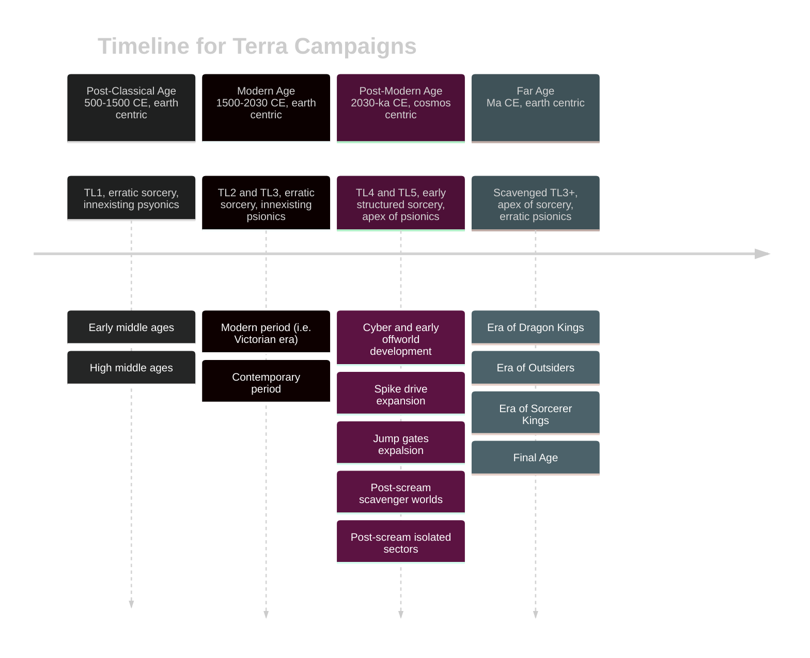

# Terra Campaigns

| Tech level (TL) description | SWN TL | [Cepheus TL](https://www.orffenspace.com/cepheus-srd/equipment.html) | Civilization 6 Eras         |
| --------------------------- | ------ | -------------------------------------------------------------------- | --------------------------- |
| Primitive                   | 0      | 0                                                                    | Ancient, Classical          |
| Medieval                    | 1      | 1                                                                    | Medieval                    |
| Industrial                  | 2      | 2-4                                                                  | Renaissance, Industrial     |
| Modern                      | 3      | 5-7                                                                  | Modern, Atomic, Information |
| Future                      | 4      | 8+                                                                   | Future                      |
| Post-future                 | 5      | 15+                                                                  |                             |

## Current Campaigns

### Hostile
> **Post-Modern Age | Spike Drive Expansion (2225 CE) | Near Earth Zone**
> **Style**: Blue collar, gritty sci fi horror
> **Sources**: SWN, Hostile, Hard Light
> Played in 2023

Valuable alien RNA is found in a debris field in the Perdurabo system. Tharsis Mining hires a crew to prospect the icy rocks and evaluate the commerciality of exploiting the RNA resource.

### BenooedeNova
> **Post-Modern Age | Post Scream Isolated Sectors (3234 CE) | Near Earth Zone**
> **Style**: Space Opera
> **Sources**: SWN, Hard Light
> Played in 2023

Alien tombs are found in the Hard Light system.

### Arrival
> **Far Age | Early Final Age | Latter Earth (Maqqatba)**
> **Style**: Decadent high-fantasy, cosmic horror
> **Sources**: 5e Ravenloft, Atlas of the Later Earth, Godbound, Silent Legions
> Played in 2023

The Angels have started to arrive in the Latter Earth. They come to revenge the destruction laid out in Heaven by the Sorcerer-Kings and their Made-Gods, at the end of the previous age. In the cold lands of Maqqatba, the celestial beings will face the Sorcerer-King of Turnskull in the south, while the outsider god Ethux'zhur attempts to enter Earth again.

## Future Campaigns

### Empires of the Silk Road
> **Post-Classical Age | 13th Century | Earth (Silk Road)**
> **Style:** Gritty historical low fantasy
> **Sources**: WWN (Drylands rules), Wolves of God,  Nightmares, Historica Arcanum, Book of The Red Tides

### The City of Crescent
> **Modern Age | 19th Century | Earth (Istanbul)**
> **Style**: Gothic horror
> **Sources**: Godbound (Bloodhound rules), Blood Hack, Historica Arcanum, Kult

Human potential is reached in the region around Istambul. The ones who awake, emerge as creatures of the night.

### Delta Green
> **Modern Age | 1990 CE | Earth (USA)**
> **Style**: Cosmic horror, conspiracy
> **Sources**: SWN, Delta Green, Silent Legions

### Silicon Samba
> **Post-Modern Age | 2105 CE | Earth (Rio de Janeiro)**
> **Style**: Latin cyberpunk
> **Sources**: SWN, CWN
> Prepared in 2023, halted game

### After Mutant
> **Post-Modern Age | 28th Century | Earth**
> **Style**: Post apocalyptic, scavenger world
> **Sources**: CWN, Other Dust, Fallout, Mutant Year Zero

### Dark Sun
> **Far Age | Era of Dragon Kings | Earth**
> **Style**: Post apocalyptic fantasy
> **Sources**: Shadowdark, AD&D Dark Sun
