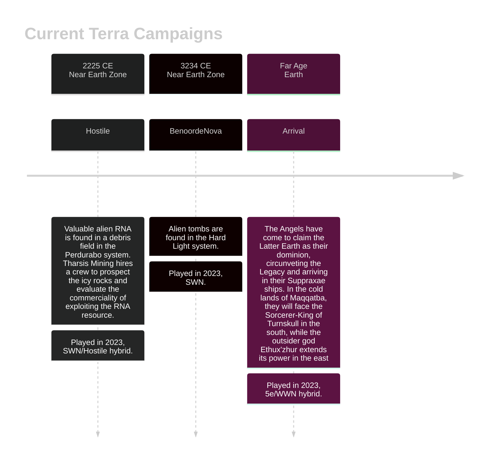
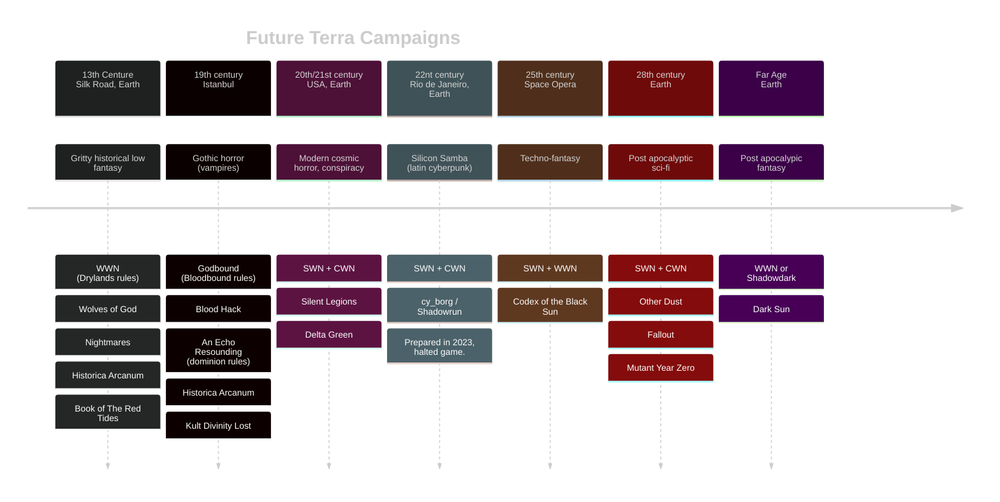

# Terra Campaigns

```mermaid
%%{init: { 'logLevel': 'debug', 'theme': 'dark' } }%%
timeline
        title Current Terra Campaigns
		section 2225 CE <br> Near Earth Zone
			Hostile
			: Valuable alien RNA is found in a debris field in the Perdurabo system. Tharsis Mining hires a crew to prospect the icy rocks and evaluate the commerciality of exploiting the RNA resource.
			: Played in 2023, SWN/Hostile hybrid.
		section 3234 CE <br> Near Earth Zone
			BenoordeNova
			: Alien tombs are found in the Hard Light system.
			: Played in 2023, SWN.
		section Far Age <br> Earth
			Arrival 
			: The Angels have come to claim the Latter Earth as their dominion, circunveting the Legacy and arriving in their Suppraxae ships. In the cold lands of Maqqatba, they will face the Sorcerer-King of Turnskull in the south, while the outsider god Ethux'zhur extends its power in the east
			: Played in 2023, 5e/WWN hybrid.
```

```mermaid
%%{init: { 'logLevel': 'debug', 'theme': 'dark' } }%%
timeline
        title Future Terra Campaigns
        section 13th Centure <br> Silk Road, Earth
	        Gritty historical low fantasy
			: WWN <br> (Drylands rules)
			: Wolves of God
			: Nightmares
			: Historica Arcanum
			: Book of The Red Tides
		section 19th century <br> Istanbul
			Gothic horror <br> (vampires)
			: Godbound <br> (Bloodbound rules)
			: Blood Hack
			: An Echo Resounding (dominion rules)
			: Historica Arcanum
			: Kult Divinity Lost
		section 20th/21st century <br> USA, Earth
			Modern cosmic horror, conspiracy
			: SWN + CWN
			: Silent Legions
			: Delta Green
        section 22nt century <br> Rio de Janeiro, Earth
	        Silicon Samba <br> (latin cyberpunk)
			: SWN + CWN
			: cy_borg / Shadowrun
			: Prepared in 2023, halted game.
		section 25th century <br> Space Opera
			Techno-fantasy
			: SWN + WWN
			: Codex of the Black Sun
		section 28th century <br> Earth
			Post apocalyptic sci-fi
			: SWN + CWN
			: Other Dust
			: Fallout
			: Mutant Year Zero
		section Far Age <br> Earth
			Post apocalypic fantasy
			: WWN or Shadowdark
			: Dark Sun
```
