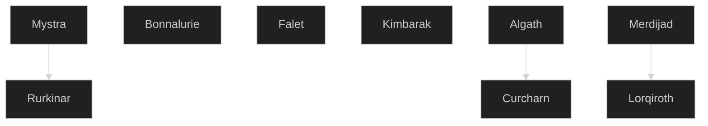

# Religions of Guemenos

## Mystra, the Lady of Mysteries

Mystra is a major deity who leads an entire pantheon of gods related to nature, knowledge and life. Mystra's is the most important pantheon of the Yotunn Ancestors folk religion group.

Mystran clergy work hard to preserve all magical lore so that magic can flourish in the future regardless of what befalls the thinking races of Guemenos or the powers of the planes. Her clerics were encouraged to explore magical theory and create new spells and magic items. Its members sought out those skilled in magic or who had the potential to become magic-wielders of importance. The clergy actively seek out sources of old magic, often from tombs, dangerous ruins - even liches. They consider it more crucial to know the precise location of artefacts and items of magical power than to possess them, but wherever possible, they work to wrest control of such things from the aggressively evil, the irresponsible, and the unsound of mind. 

> “Love magic for itself. Do not treat it just as a weapon to reshape the world to your will. True wisdom is knowing when not to use magic. Strive to use magic less as your powers develop, but not when the price is paid by others. Conduct yourself humbly, not proudly, while being mindful of this. Use the Art deftly and efficiently, not carelessly and recklessly.”
> 
> "Seek always both to learn new magic and to create new magic, but experimenting to learn to craft something oneself is better than merely buying scrolls or hiring tutors.”
> 
> "Exult more in creation than in hurling spells, and ensure that your creations are shared with others and so outlive you. Those who succeed in this last and in maturing into true wisdom are most favored in the eyes of the Lady and will serve her beyond death as beings who have become one with magic and live on in it forever."

### Rurkinar, the Brown Eagle

Rurkinar, the Brown Eagle, is the second highest deity in Mystra's pantheon, behind only Mystra herself. The Rurkinar followers, and cultists, are the most relevant Yotunn representation on the northeast (to the east of Mystra's).

The Rurkinar Cultists are a group of shamans that believe in direct communication with the Brown Eagle through rituals.

## Bonnalurie

An old goddess of diligence and knowledge. Her believers and followers have all been forgotten for more than 10 thousand years.

## Falet, the Almighty Lord

A relatively new god. His worshipers believe in monotheism and are very active preachers and converters. Their high priest sits in Olivepia (northwest peninsula of the continent). The high priest is said to have great influence in the ruler of Olivepia. Their church also have a military organisation attached.

## Kimbarak, the Dwarven Spirit

The oldest of the dwarven gods.

## Algath, Goddess of Life and Death

The highest old god on the domain of life and death.

## Curcharn, the Boatman and Spirit of the Darklake

A minor deity in the pantheon of Algath. Curcharn is the spirit that holds the door of the land of the dead. It is told such a door is in the Darklake, in the Ghost Domain.

## Merdijad, the Puppet Master

Merdijad is one of the most powerful gods of Guemenos. She is a trickster goddess.

### Lorquiroth, Commander of Turnskull

Lorquiroth is a warrior god, and looks after soldiers from his throne in the legendary castle of Turnskull.