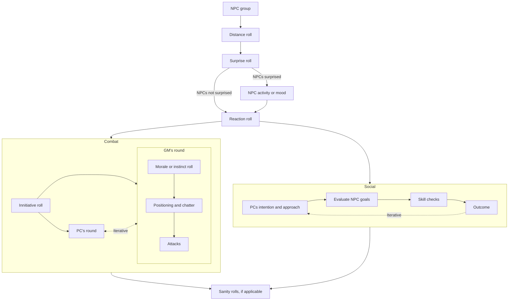

# Resolution rules

## Skill checks
> **Reference**: [SWN](https://drive.google.com/file/d/1s9ThcGpnoimZm49370hdDDsfdPMftj-n/view?usp=drivesdk) pp. 47 and [Nightmares Underneath 1e](https://drive.google.com/open?id=1cJ6nqUM3P4F5mKRKNeBSXQUwyODcfB2L&usp=drive_fs) pp. 50

- **Opposed checks** should be used for most situations involving PCs vs. NPCs - i.e. NPCs' roll define DC. The GM might define that the minimum DC for some social situations is the NPC's morale score.
- **Unopposed checks** are used when a NPC is not the source of the DC for the ckeck. In this case, use the table below (which includes some conversion between Cepheus Engine and 5e to SWN.

| SWN DC | CE DM               | 5e DC |
| ------ | ------------------- | ----- |
| N/A    |                     |       |
| 6      | Routine (+2)        | 10    |
| 8      | Average (0)         | 15    |
| 10     | Difficult (-2)      | 20    |
| 12     | Very difficult (-4) | 25    |
| 14     | Formidable (-6)     | 30    |

Regardless of the type of check, a result 1 or 2 points below the target DC can be considered a **partial success**, or a success at a cost.
# Harm and violence

- Two types of a character's vitality: Physical and Mental
- **Physical vitality** is measured with HP and system strain.
- **Mental vitality** is measured with Grip and delirium.

## Hit points (HP)

*HP can be thought of as a character's **disposition** to overcame harm - a combination of grit, luck, stamina, awareness of danger, energy and reflexes, and a generalised (and possibly desperate) determination to not be murdered.*

## Grip
***Humanity, Sanity and Willpower, simplified from [Silent Legion's Madness](https://drive.google.com/open?id=1CexCpDNKNSMNnkGgDNrVne1gG-03L5dm&usp=drive_fs)***

*Bloodshed, exposure to horror and pushing oneself to accomplish inhuman acts can break havoc in the minds of mundane creatures, consuming their **Grip**. The best that most sufferers can do is to accept a **Delirium,** creating a zone of scorched reason to serve as a buffer against the awareness of the cruel and impossible.*

The maximum **Grip** score for a PC is defined as
$$\text{Max Grip} = 10 \le \text{max(INT, WIS)} \le 18$$
If the current **Grip** score reaches zero the character is hopelessly lost in their own tormented perceptions and can no longer function as a PC.

Once per scene, the GM might require PCs to make a **Grip** check: a d20 roll under the current **Grip** score. On a failure the PC looses *one* **Grip** as per table below. Major supernatural events might cost *two* **Grip** instead.

**Players might choose to accept a Delirium** for their characters to recover **Grip**. The player can choose what delirium they get (see material below) or roll randomly in a chosen table. It is easier to choose the new Delirium in-between sessions, and discuss the role play and mechanical results with the GM.

**Deliria examples and references (non comprehensive)**
- Madness from Nightmares Underneath 
- 5e's long term of indefinite madness [tables](http://dnd5e.wikidot.com/madness)
- 3.5e SRD variant indefinite insanity [table 6-11](https://www.d20srd.org/srd/variant/campaigns/sanity.htm)
- Call of Cthulhu's [phobias and manias](https://cthulhuwiki.chaosium.com/rules/sanity.html#sample-phobias-and-manias)
- Silent Legions' [sample deliria](https://i.imgur.com/pHGjaC1.png)
- Best Left Buried's [afflictions](https://drive.google.com/file/d/1gMvMcuhIFXWkvjqnP8e-XpcMVObmRVrY/view) (zine 5)

After taking the Delirum the player **rolls 1d20; if the roll is equal or greater than their total number of Deliria** then the newfound structure and rationalisation soothes their mind, **recovering 2 Grip**. If the roll is less than their total number of Deliria, then the fresh insanity just makes everything worse, and 2 points of sanity are lost. Once accrued, Deliria can never be lost.

Some Deliria come with phobias and compulsions. A PC can resist the phobia or compulsion by expending 1 **Grip** for defying the structure they have fashioned.

(Look at Mothership and Nightmares Madness rules)

Very simple SWN rule adaptation for Grip:
- Roll a mental save, if succeeded nothing happens
- If failed, add a system strain
- If no system strain is available, get a Nightmare

- A system strain point can always be carved with Torching (swn.31)

# NPCs

### NPC resolution rules
***Inspired by Nightmares Underneath, and the Without Number games***

**Saving throws** are rolled with a d20, applying the **appropriate attribute** as modifier, against the target defined as **Save** on the statblock. Sometimes, the offensive actor can apply penalties to the roll.

**Skill checks**, opposed or not, are rolled with the **appropriate attribute** as modifier in **2d6** systems, or **twice the attribute** in **d20** systems. DC target are defined as per the original system. This modifier is only used when the NPC is expected to be skilled in the action. 

**Morale** in an unilateral check done when situations like the below arise. It is run with **Will** as modifier on a 2d6 roll.

- After a round during which one or more allied creatures have been reduced to zero HP.
- After a round during which a creature lost half its HP or more. 
- After reinforcements arrive on the enemy side.

| Roll | Result                                                            |
| ---- | ----------------------------------------------------------------- |
| 0-3  | Will is broken, they flee immediately                             |
| 4-6  | They retreat strategically                                        |
| 7-9  | They continue to fight, but consider improved strategic positions |
| 10+  | They continue, undeterred                                         |

## NPC interaction procedure

